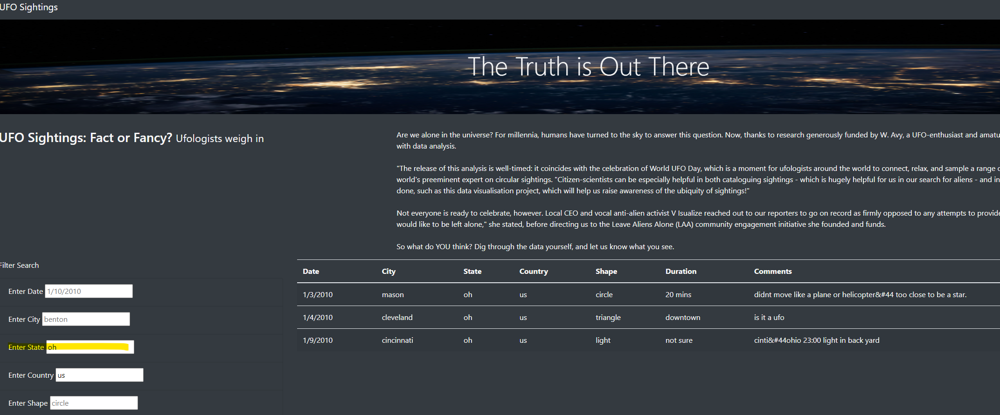
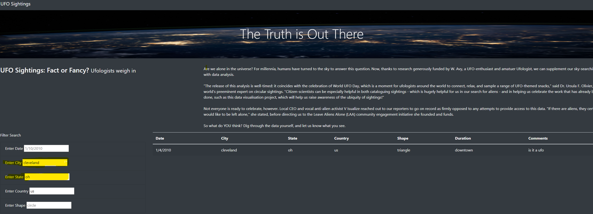
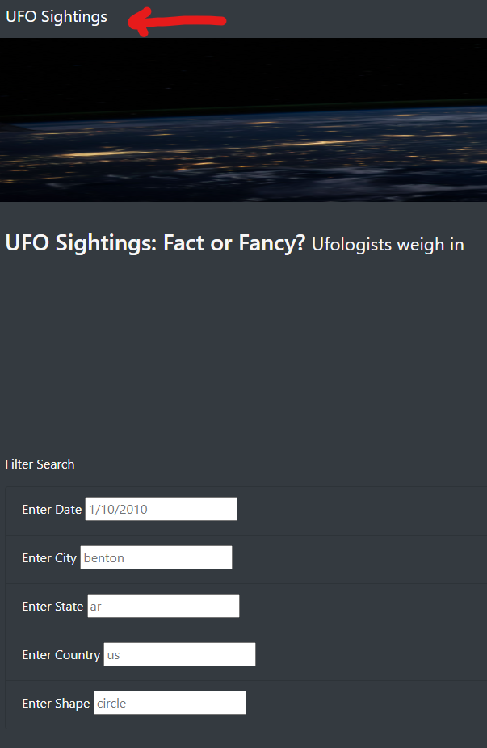

# UFO-Sightings

## Overview of the analysis

Dana wanted to create a website that has UFO sightings data.  She was able to get data from a specfic period from
January 1st 2010 to January 13th 2010.  We wanted to create this database that a user could come to the website
and search for UFO sightings during this time period to make their own conclussions.  We wanted the data to be
filtered per the users requests and our data had some specific ways we could do this.  We were able to filter 
the data by date, city, state, country and shape of the sighting.  This way a user had many ways to search 
what would interest them.

## Results

The site is easy to filter for what the user is looking for.  We have five available seearch elements.  The five
are date, city, state, country and shape.  The user doesn't have to fill in all five but can just filter for
one item.  As you can see here we've searched by the State of Ohio (oh) and it brings up 3 sightings from
our data.  

The user though can get more specific if they want.  Looking at our previous listing for Ohio our user
can get a bit more specific.  This next search we added the city (Cleveland) with the state (OH) and it
filtered out just the one sighting that was in Cleveland.  

## Summary

There are some drawbacks to the page.  One is to reset our search parameters the user must click on the upper
left of the webpage.  This is a fine function to have except to have it at the upper left away from our 
actual search isn't a great place to have it.  Additionally the user would have no idea that even resets it, it just says
"UFO Sightings" which has zero to do with reseting a search filter.

There are some additonal items we'd recommend as well after reviewing the website and data.

1. The search boxes aren't justiied together.  So the boxes vary on when they start depending on how long
the search criteria is, like "enter date" vs "enter country".  Becuase country is a longer word than date
our search box juts out more.  We need to make it cleaner and format them all to start at the same spot.
2. Speaking of the country, our data only has data from the US.  This is a search parameter not needed and
also somewhat confusing for the user that may think we have multiple countries in this database.  

